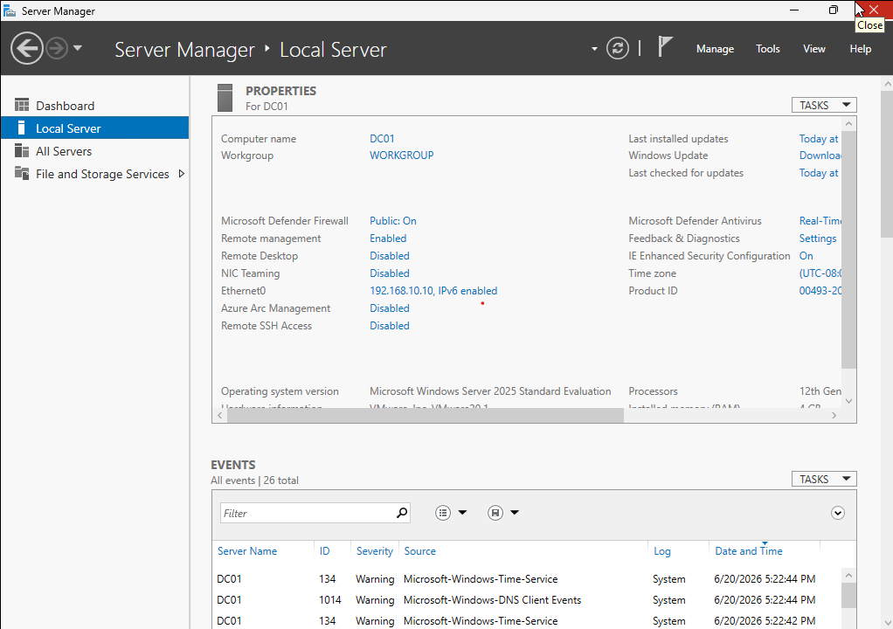
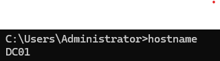
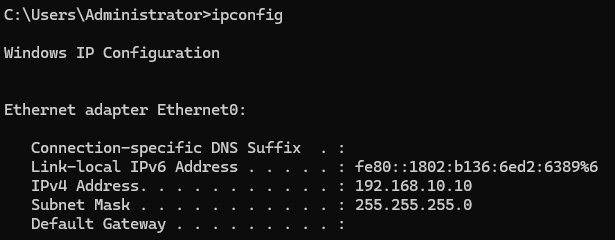

# Lab 01 - Windows Server Preparation

## Objective

Prepare a Windows Server 2022 machine for Active Directory deployment.

---

## Environment

| Component | Value |
|------------|---------|
| Operating System | Windows Server 2022 |
| Server Name | DC01 |
| Network Type | NAT |
| IP Address | 192.168.10.10 |

---

## Tasks Performed

### 1. Windows Server Installation

Installed Windows Server 2022 Desktop Experience and completed initial configuration.

**Verification**



---

### 2. Server Renaming

Changed the default hostname to DC01.

**Verification**

Command:

```cmd
hostname
```

Expected Output:

```text
DC01
```

Screenshot:



---

### 3. Static IP Configuration

Configured a static IPv4 address for the server.

**Verification**

Command:

```cmd
ipconfig
```

Screenshot:



---

## Validation Results

| Validation | Status |
|------------|---------|
| Windows Server Installed | ✅ |
| Hostname Changed to DC01 | ✅ |
| Static IP Assigned | ✅ |
| Network Connectivity Verified | ✅ |

---

## Outcome

The server has been successfully prepared and is ready for Active Directory Domain Services deployment.

## Lessons Learned

- Windows Servers should use static IP addresses before installing Active Directory.
- Proper server naming helps identify infrastructure roles.
- Verifying configurations immediately helps prevent future troubleshooting issues.
